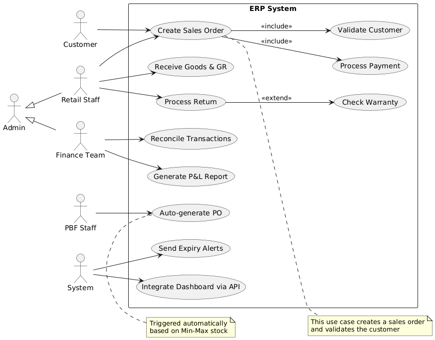

# ERP System – Use Case Diagram



This document provides a description of the ERP System use case diagram, covering key actors, system boundaries, use cases, and relationships.

---

## 🎭 Actors
- **Customer** – Initiates purchases by creating sales orders.
- **Retail Staff (RS)** – Handles order creation, goods receiving, and returns.
- **PBF Staff (PBF)** – Manages procurement through automated purchase orders.
- **Finance Team (FIN)** – Oversees reconciliation and reporting.
- **System (SYS)** – Executes automated tasks (expiry alerts, dashboard integration).
- **Admin** – Generalized role with rights to perform **Retail Staff** and **Finance Team** actions.

---

## 📦 Use Cases
1. **Create Sales Order**  
   - Sales staff creates an order for a customer.  
   - Includes:
     - **Validate Customer** – Ensures customer is eligible.  
     - **Process Payment** – Processes the transaction.  

2. **Receive Goods & GR (Goods Receipt)**  
   - Retail staff acknowledges incoming goods.

3. **Process Return**  
   - Customer returns items, validated with:
     - **Check Warranty** (<<extend>>) – Determines if return is valid under warranty.

4. **Auto-generate PO (Purchase Order)**  
   - Triggered automatically based on **Min-Max stock levels**.  

5. **Reconcile Transactions**  
   - Finance team reconciles daily/monthly transactions.

6. **Generate P&L Report**  
   - Finance team generates store/company Profit & Loss reports.

7. **Send Expiry Alerts**  
   - System automatically alerts when items near expiry.

8. **Integrate Dashboard via API**  
   - ERP provides data integration for external dashboards.

---

## 🔗 Relationships
- `<<include>>`  
  - **Create Sales Order** → **Validate Customer**  
  - **Create Sales Order** → **Process Payment**

- `<<extend>>`  
  - **Process Return** → **Check Warranty**

---

## 📝 Notes
- **Create Sales Order**: Core business process validating customers and handling payments.  
- **Auto-generate PO**: Automatic restocking mechanism triggered by inventory thresholds.  

---

## 📂 Files
- `erp-usecase.puml` → PlantUML source file  
- `erp-usecase.png` → Generated diagram image  

---

## 🚀 How to Generate Diagram
If you want to regenerate the diagram:
```sh
plantuml erp-usecase.puml
